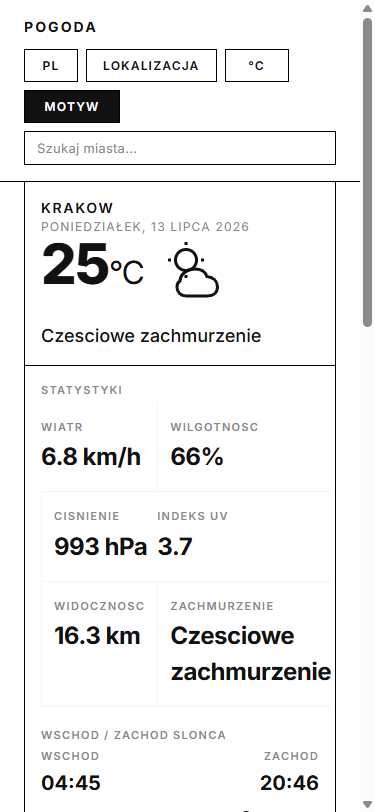

# Weather App (Swiss Design)

A minimalist weather website built with HTML, CSS, and modular JavaScript (ES Modules).
It fetches live weather, forecast, geocoding, and air quality data from Open-Meteo APIs and presents them in a clean Swiss-inspired layout.

## Screenshots

### Mobile

<p align="center">
  
</p>

### Live Demo

[weather-app-five-taupe-24.vercel.app](https://weather-app-five-taupe-24.vercel.app/)

## Live Features

- Current weather for the selected city
- City search with autocomplete (Open-Meteo Geocoding)
- Geolocation button for local weather
- Celsius/Fahrenheit unit toggle
- Light/dark theme toggle
- 24-hour hourly forecast strip
- 24-hour temperature chart (SVG)
- 7-day forecast table
- Air quality panel (European AQI)
- Sunrise/sunset progress indicator
- Component-style DOM rendering (without framework)
- Loading skeleton to reduce layout shifts (better CLS)
- Initial HTML skeleton (before JS execution) for stable first paint
- Stable header control widths to reduce micro layout shifts
- Better error handling with retry button
- Basic accessibility improvements (ARIA/live status)
- Settings persistence with localStorage (city, units, theme)
- Responsive layout for desktop and mobile

## Tech Stack

- HTML5
- CSS3
- TypeScript (strict mode)
- Vite (dev server + build)
- Open-Meteo APIs
- Vitest (unit testing)
- GitHub Actions (CI: typecheck + test + build)

## API Endpoints Used

- Forecast API: `https://api.open-meteo.com/v1/forecast`
- Geocoding API: `https://geocoding-api.open-meteo.com/v1/search`
- Air Quality API: `https://air-quality-api.open-meteo.com/v1/air-quality`

## Run Locally

### Development server (recommended)

```bash
npm install
npm run dev
```

Vite serves the app at `http://localhost:5173` with hot module replacement.

### Production build

```bash
npm run build
npm run preview
```

The built site is in `dist/` and can be deployed to any static host (Vercel, Netlify, GitHub Pages).

### Option 3: VS Code Live Server

You can still use Live Server on `index.html`, but the dev server (`npm run dev`) is recommended for TypeScript support.

## Tests

```bash
npm install
npm test
```

Tests cover the pure utility functions: unit conversion, AQI percentage/description, sun progress, date/time formatting, and hour index calculation.

## Project Structure

```text
.
├── src/
│   ├── i18n.ts        # Translation constants and t() helper
│   ├── state.ts       # Application state singleton, localStorage persistence
│   ├── utils.ts       # Pure utility functions (unit conversion, AQI, sun progress, formatting)
│   ├── icons.ts       # SVG icon generators and WMO weather code mapping
│   ├── api.ts         # Open-Meteo API client (fetch with timeout)
│   ├── render.ts      # DOM rendering functions (cards, chart, loading, error states)
│   └── main.ts        # Entry point: event listeners, autocomplete, debug mode
├── tests/
│   └── utils.test.ts  # Vitest unit tests for pure utility functions
├── .github/
│   └── workflows/
│       └── ci.yml     # GitHub Actions: typecheck + test + build on push/PR
├── index.html
├── styles.css
├── tsconfig.json
├── vite.config.ts
├── vitest.config.ts
├── package.json
└── README.md
```

## Notes

- No API key is required for the Open-Meteo endpoints used in this project.
- Internet connection is required to fetch live weather and air quality data.
- Default startup location is Krakow (`lat: 50.06`, `lon: 19.94`).
- Debug mode is available with `?debug=1`.

## Debug Mode (Tests + Benchmark)

You can run built-in debug checks directly in the browser console.

1. Open the app with the `debug` query param, for example:
   - `index.html?debug=1`
2. Open DevTools Console.

In debug mode the app runs:
- lightweight self-tests for utility logic (unit conversion, AQI cap, sun progress bounds)
- one render benchmark after the first successful data load (10 runs with avg/min/max)

## Author

- GitHub: [w3ziqv](https://github.com/w3ziqv)
