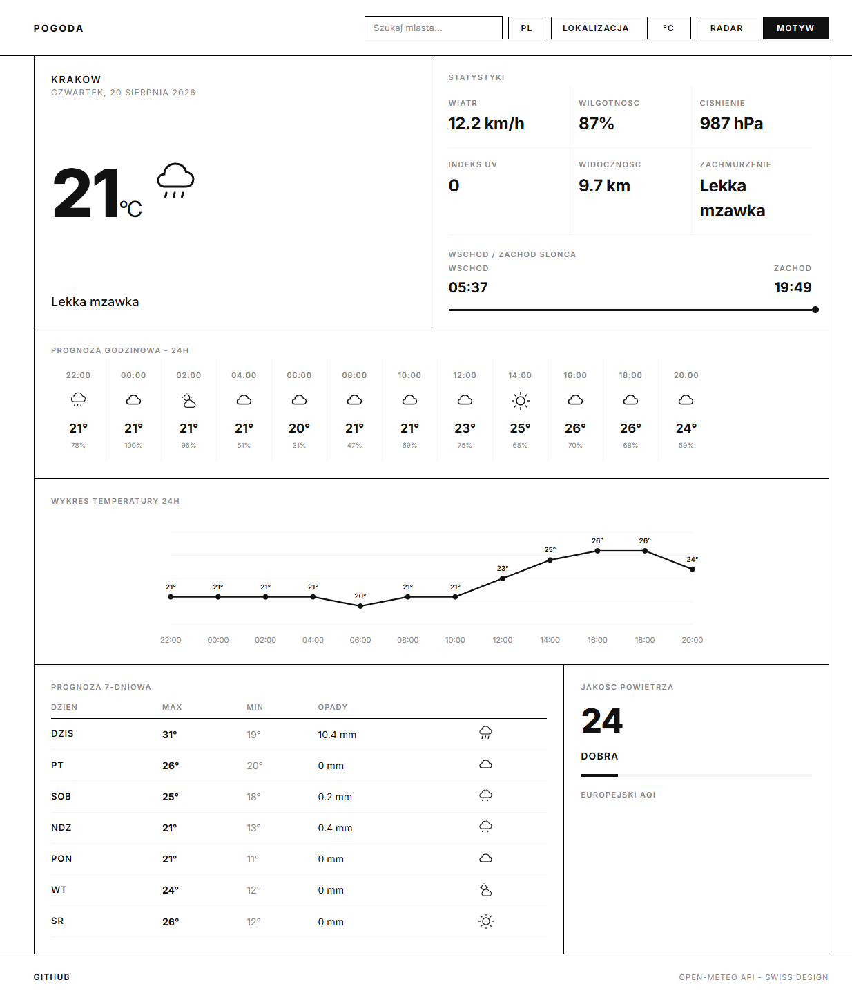
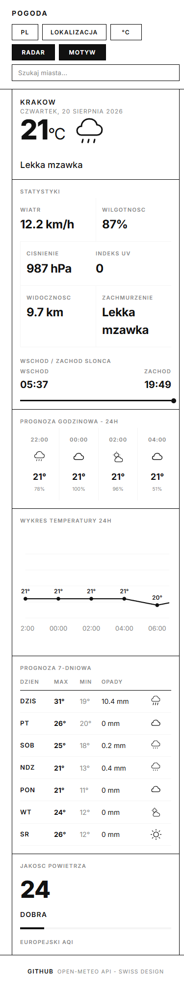
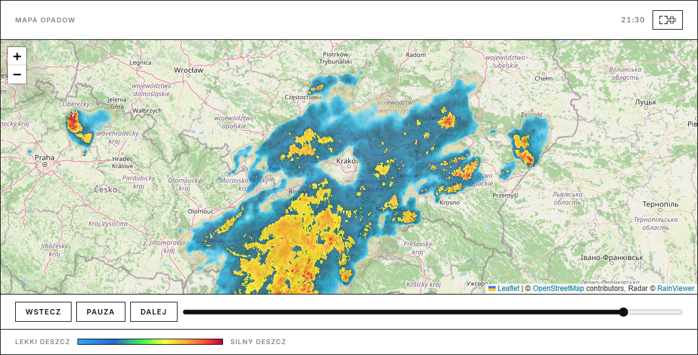
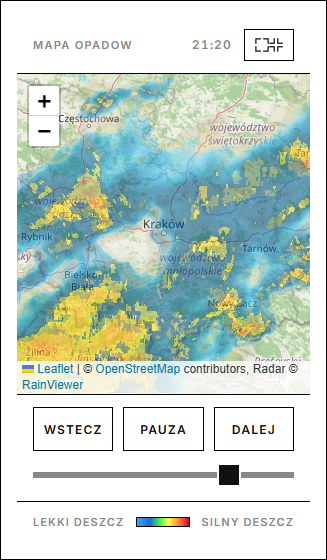

# Weather App

Minimalist weather app with a Swiss-inspired layout. Fetches current conditions, an hourly and daily forecast, and air quality from the free Open-Meteo APIs. Includes a precipitation radar view (Leaflet + RainViewer), a temperature chart, and PWA support.

## Screenshots

| Desktop | Mobile |
| --- | --- |
|  |  |

| Radar (desktop) | Radar (mobile) |
| --- | --- |
|  |  |

## Features

- Current weather, hourly forecast, and 7-day forecast
- Precipitation radar map with frame animation (play/pause, slider, fullscreen)
- Air quality panel (European AQI)
- City search with autocomplete and geolocation
- Celsius/Fahrenheit toggle and light/dark theme
- Sunrise/sunset indicator and 24-hour temperature chart (SVG)
- Persists settings (city, unit, theme) in localStorage
- PWA: installable, offline-capable via service worker
- Fully responsive

## Tech Stack

- TypeScript (strict), Vite
- Leaflet for the radar map
- Open-Meteo APIs (forecast, geocoding, air quality, RainViewer radar tiles)
- Vitest for unit tests
- GitHub Actions for CI

## Getting Started

Requires Node.js.

```bash
npm install
npm run dev
```

Build for production:

```bash
npm run build
npm run preview
```

Run tests:

```bash
npm test
```

## Configuration

No API keys are required. The app reads live data from Open-Meteo and RainViewer public endpoints. Default location is Kraków; the user can search for any city or use geolocation.

## Project Structure

```
src/
  api.ts       Open-Meteo and RainViewer clients
  radar.ts     Radar frame parsing and tile URL helpers
  radar-view.ts Leaflet radar map and animation
  render.ts    DOM rendering
  state.ts     App state and localStorage persistence
  i18n.ts      Translations (PL/EN)
  utils.ts     Pure helpers (unit conversion, AQI, sun progress)
  main.ts      Entry point and event wiring
tests/
  utils.test.ts
  radar.test.ts
```

## License

MIT
